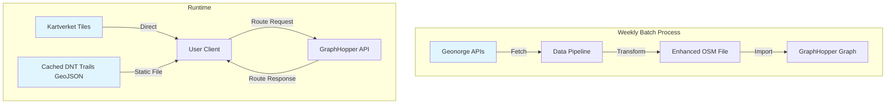

# GraphHopper Implementation Proposals for Norwegian Trail Routing

## Executive Summary

Three architectural approaches for implementing your requirements, from simplest to most sophisticated. All support snap-to-trail routing with Geonorge data, cross-platform access (Linux + iOS), and offline capabilities.

## MVP Strategy

**Start with Norway only, but architect for multi-country support from day one.**

### Phase 1: Norway MVP (Weeks 1-4)
- Focus exclusively on Norwegian data (Geonorge/Kartverket)
- Implement core routing with DNT trails
- Use AR5 land cover and DTM elevation
- Test and refine with real Norwegian trails

### Phase 2: Multi-Country Expansion (Future)
- Architecture already supports it - just add providers
- No refactoring needed, only configuration
- Can add countries incrementally as needed

This approach gives you a working system quickly while avoiding future technical debt.

## Architecture Clarification

### Key Concepts - Two Different Data Flows

**IMPORTANT**: The same data (trails, elevation, land cover) serves TWO different purposes:

```
ROUTING DATA (Pre-processed)          DISPLAY DATA (Real-time)
─────────────────────────────          ──────────────────────────
Weekly Pipeline                        Direct from Provider
      ↓                                      ↓
Merged into OSM                        Map Tiles (visual)
      ↓                                Trail Overlays (GeoJSON)
GraphHopper Graph                      Elevation Profiles (charts)
      ↓                                      ↓
Route Calculation                      Client Display
```

### 1. Routing Data (Pipeline → GraphHopper)
- **Purpose**: Build routing graph for pathfinding
- **Process**: Weekly batch job fetches and merges data
- **Storage**: Pre-processed into GraphHopper's binary format
- **Usage**: Only accessed by GraphHopper internally
- **Example**: DNT trail merged as OSM way with `sac_scale=T2`

### 2. Display Data (Provider → Client)
- **Purpose**: Visual display and interaction in UI
- **Process**: Real-time fetching as needed
- **Storage**: Cached in CDN or client
- **Usage**: Directly by client application
- **Example**: Show all DNT trails on map as red lines

### MVP Architecture (Norway Only)

```
┌─────────────────────────────────────────────────────────┐
│                  MVP ARCHITECTURE                       │
├─────────────────────────────────────────────────────────┤
│                                                         │
│  WEEKLY BATCH                    RUNTIME               │
│  ─────────────                   ─────────             │
│                                                         │
│  [Data Pipeline]                 [Client App]          │
│       ↓                               ↑                │
│  (1) Fetch from Geonorge         (4) Route Request     │
│       ↓                               ↓                │
│  (2) Transform & Merge           [GraphHopper API]     │
│       ↓                               ↑                │
│  (3) Upload to GraphHopper       (5) Route Response    │
│                                       ↓                │
│                                  [Display Route]       │
│                                       +                │
│                                  [Kartverket Tiles]    │
│                                  (direct, no proxy)    │
└─────────────────────────────────────────────────────────┘
```

### What Runs Where

| Component | Location | Purpose | MVP Needed? |
|-----------|----------|---------|-------------|
| Data Pipeline | Cloud/Cron | Weekly data fetch & transform | ✅ Yes |
| GraphHopper | Cloud Server | Routing calculations only | ✅ Yes |
| Tile Proxy | Cloud/CDN | Forward to map providers | ❌ No (MVP) |
| Trail Proxy | Cloud/CDN | Fetch trail details | ❌ No (MVP) |
| Elevation Proxy | Cloud/CDN | Query elevation points | ❌ No (MVP) |
| Client App | User Device | Display & interaction | ✅ Yes |

### Why No Proxies for MVP?

For Norway-only MVP, you can simplify:

1. **Map Tiles**: Kartverket allows direct access
   ```javascript
   // Direct to Kartverket, no proxy needed
   tiles: ['https://cache.kartverket.no/topo4/{z}/{x}/{y}.png']
   ```

2. **Trail Display**: Cache GeoJSON client-side
   ```javascript
   // One-time fetch, cache in app
   const trails = await fetch('cached-dnt-trails.geojson');
   ```

3. **Elevation Profile**: GraphHopper returns it
   ```javascript
   // GraphHopper response includes elevation
   route.elevation_profile // [100m, 105m, 110m, ...]
   ```

### When You Need Proxies (Multi-Country)

Proxies become necessary when:
- Multiple countries with different APIs
- Authentication/rate limiting per provider
- Real-time data queries across borders
- Dynamic provider selection based on location

### Custom Client vs GraphHopper UI

**Build your own client!** GraphHopper's UI is generic.

| Feature | GraphHopper Default UI | Your Custom Client |
|---------|------------------------|-------------------|
| Map Style | Generic OSM | Norwegian topo maps |
| Trail Display | None | DNT trails overlay |
| **Trail Info** | **None** | **Click for full details** |
| Difficulty | Basic | SAC scale + Norwegian grades |
| Elevation | Line chart | Interactive profile |
| Offline | No | Yes (with caching) |
| Language | English | Norwegian |
| DNT Huts | No | Yes, with booking |
| Seasonal | No | Summer/Winter modes |

### Interactive Trail Information Feature

**Critical for user experience**: Users need to inspect trails before routing.

#### Data Requirements
The GeoJSON must preserve ALL attributes from source data:
- **Identity**: Name, ID, official route designation
- **Maintenance**: Maintainer (DNT, Kommune, Private), last maintained date
- **Difficulty**: Grade, technical rating, fitness required
- **Marking**: Type (T-marks, cairns, none), quality, visibility
- **Physical**: Surface, width, exposure, obstacles
- **Seasonal**: Summer/winter accessibility, snow conditions
- **Safety**: Warnings, hazards, emergency exits

#### Interaction Patterns
1. **Hover**: Quick preview (name, difficulty, length)
2. **Click**: Full information panel
3. **Right-click**: Context menu (use for routing, download GPX)
4. **Touch** (mobile): Tap for info, long-press for options

#### Performance Considerations
- For <1000 trails: GeoJSON works fine
- For >1000 trails: Use vector tiles for better performance
- Consider clustering at low zoom levels
- Load detailed attributes on-demand if needed

## Important Requirements Analysis

### Core Requirements (What You Asked For)
- ✅ Snap-to-trail routing with Norwegian trails
- ✅ Geonorge data integration (trails, elevation, land cover)
- ✅ Linux desktop access (native or web)
- ✅ iOS mobile access
- ✅ Offline capability
- ✅ **Multi-Country Data Support**: Different providers for ALL geographic data types
  - **Maps/Tiles**: Visual base maps for display
    - Norway: Kartverket topo maps
    - Sweden: Lantmäteriet Terrängkartan
    - Finland: Maanmittauslaitos background maps
    - Germany: BKG TopPlus
    - Switzerland: Swisstopo pixel maps
    - Default: OpenStreetMap tiles
  - **Trail Data**: Country-specific trail networks
    - Norway: DNT trails from Geonorge
    - Sweden: STF trails from Lantmäteriet
    - Finland: Retkikartta trails
    - Germany: Wanderwege networks
    - Switzerland: SwitzerlandMobility trails
  - **Elevation Models**: High-resolution terrain data
    - Norway: Kartverket DTM (1-10m resolution)
    - Sweden: Lantmäteriet elevation model
    - Finland: Maanmittauslaitos DEM
    - Germany: BKG DGM
    - Switzerland: swissALTI3D
    - Default: SRTM (30m resolution)
  - **Land Cover**: Terrain type classification
    - Norway: AR5/AR50 from Geonorge
    - Sweden: Lantmäteriet land cover data
    - Finland: CORINE Land Cover
    - Germany: ATKIS/ALKIS
    - Switzerland: swissTLM3D
    - Default: OSM land use tags

### Hidden Requirements (What You'll Need)
- 🔍 **Data Updates**: How to handle trail/map updates
- 🔍 **Multi-User**: Family members sharing routes?
- 🔍 **Backup/Sync**: Route history across devices
- 🔍 **Safety Features**: Emergency offline access
- 🔍 **Performance**: Response time expectations
- 🔍 **Storage**: ~15GB for full offline data per country
- 🔍 **Privacy**: Self-hosted vs cloud
- 🔍 **Maintenance**: Update effort tolerance
- 🔍 **Map Provider Management**: Handle different APIs, authentication, attribution

## MVP Data Flow (Norway Only)

### Simplified Data Flow for MVP



### Data Pipeline Detail (Weekly)

```python
# mvp_pipeline.py - Runs weekly via cron
import requests
import geopandas as gpd
from pathlib import Path

class NorwayMVPPipeline:
    def __init__(self):
        self.data_dir = Path('/opt/graphhopper/data')

    def run_weekly_update(self):
        """Main pipeline - runs every Sunday 3am"""

        # 1. Download base OSM data for Norway
        osm_file = self.download_osm_norway()

        # 2. Download DNT trails from Geonorge
        trails = self.fetch_dnt_trails()

        # 3. Download elevation data (DTM 10m)
        elevation = self.fetch_kartverket_dtm()

        # 4. Download AR5 land cover
        landcover = self.fetch_ar5_landcover()

        # 5. Merge everything into enhanced OSM
        enhanced_osm = self.merge_data_sources(
            osm_file, trails, elevation, landcover
        )

        # 6. Import into GraphHopper
        self.rebuild_graphhopper(enhanced_osm)

        # 7. Cache trail GeoJSON for client display
        self.export_display_data(trails)

    def merge_data_sources(self, osm, trails, elevation, landcover):
        """Merge all data into OSM format for GraphHopper"""

        # Add DNT trails as ways with proper tags
        for trail in trails:
            osm.add_way({
                'highway': 'path',
                'operator': 'DNT',
                'sac_scale': trail.difficulty,
                'trail_visibility': trail.marking,
                'surface': trail.surface
            })

        # Add elevation to nodes
        osm.enhance_with_elevation(elevation)

        # Tag ways with land cover
        osm.tag_with_landcover(landcover)

        return osm

    def export_display_data(self, trails):
        """Export static files for client display WITH FULL ATTRIBUTES"""

        # Ensure ALL trail attributes are preserved for interactive display
        trail_features = []
        for _, trail in trails.iterrows():
            feature = {
                'type': 'Feature',
                'geometry': trail.geometry.__geo_interface__,
                'properties': {
                    # Essential routing attributes
                    'id': trail.get('id'),
                    'name': trail.get('navn'),

                    # Interactive display attributes
                    'maintainer': trail.get('vedlikeholdsansvarlig', 'DNT'),
                    'difficulty': trail.get('vanskelighetsgrad'),
                    'difficulty_desc': self.get_difficulty_description(trail.get('vanskelighetsgrad')),
                    'marking': trail.get('merking'),
                    'marking_desc': self.get_marking_description(trail.get('merking')),
                    'surface': trail.get('dekke'),
                    'width': trail.get('bredde'),
                    'season': trail.get('sesong'),
                    'last_maintained': trail.get('vedlikeholdsdato'),
                    'description': trail.get('beskrivelse'),
                    'warning': trail.get('advarsel'),

                    # Additional metadata
                    'length_km': trail.geometry.length / 1000,
                    'trail_type': trail.get('sti_type'),
                    'official_route': trail.get('offisiell_rute'),
                    'signs_to': trail.get('skiltet_til'),

                    # Styling hints
                    'color': self.get_trail_color(trail.get('vedlikeholdsansvarlig')),
                    'width_style': self.get_width_style(trail.get('vanskelighetsgrad'))
                }
            }
            trail_features.append(feature)

        # Export as GeoJSON with full attributes
        geojson = {
            'type': 'FeatureCollection',
            'features': trail_features
        }

        with open(self.data_dir / 'dnt-trails-interactive.geojson', 'w') as f:
            json.dump(geojson, f)

        # Also export as vector tiles for better performance with large datasets
        # This allows efficient rendering and interaction at different zoom levels
        self.generate_vector_tiles(trails, self.data_dir / 'trails-tiles')
```

### Client Implementation with Interactive Trails (MVP)

```javascript
// Enhanced client with interactive trail information
class NorwayTrailRouter {
    constructor() {
        this.graphhopperUrl = 'https://your-server/graphhopper';
        this.trailsLayer = null;
        this.selectedTrail = null;
    }

    async initialize() {
        // Load trail data with FULL attributes
        const trailsData = await fetch('/static/dnt-trails-interactive.geojson')
            .then(r => r.json());

        // Initialize map
        this.map = L.map('map');
        L.tileLayer('https://cache.kartverket.no/topo4/{z}/{x}/{y}.png', {
            attribution: '© Kartverket'
        }).addTo(this.map);

        // Add INTERACTIVE trail overlay
        this.trailsLayer = L.geoJSON(trailsData, {
            style: (feature) => this.getTrailStyle(feature),
            onEachFeature: (feature, layer) => {
                // Make trails interactive
                this.makeTrailInteractive(feature, layer);
            }
        }).addTo(this.map);
    }

    getTrailStyle(feature) {
        // Style based on difficulty/maintainer
        const props = feature.properties;
        return {
            color: props.color || this.getDifficultyColor(props.difficulty),
            weight: props.width_style || 2,
            opacity: 0.8,
            dashArray: props.marking === 'Unmarked' ? '5, 5' : null
        };
    }

    makeTrailInteractive(feature, layer) {
        // Hover effect
        layer.on('mouseover', (e) => {
            e.target.setStyle({
                weight: 5,
                opacity: 1
            });
            this.showTrailTooltip(e, feature.properties);
        });

        layer.on('mouseout', (e) => {
            this.trailsLayer.resetStyle(e.target);
            this.hideTrailTooltip();
        });

        // Click to show detailed info
        layer.on('click', (e) => {
            L.DomEvent.stopPropagation(e);
            this.showTrailDetails(feature.properties);
        });
    }

    showTrailDetails(props) {
        // Display detailed trail information panel
        const panel = document.getElementById('trail-info-panel');
        panel.innerHTML = `
            <div class="trail-details">
                <h3>${props.name || 'Unnamed Trail'}</h3>

                <div class="trail-attributes">
                    <div class="attribute">
                        <label>Maintainer:</label>
                        <span>${props.maintainer}</span>
                    </div>

                    <div class="attribute">
                        <label>Difficulty:</label>
                        <span class="difficulty-${props.difficulty}">
                            ${props.difficulty_desc}
                        </span>
                    </div>

                    <div class="attribute">
                        <label>Marking:</label>
                        <span>${props.marking_desc}</span>
                    </div>

                    <div class="attribute">
                        <label>Surface:</label>
                        <span>${props.surface || 'Unknown'}</span>
                    </div>

                    <div class="attribute">
                        <label>Length:</label>
                        <span>${props.length_km?.toFixed(1)} km</span>
                    </div>

                    <div class="attribute">
                        <label>Season:</label>
                        <span>${props.season || 'All year'}</span>
                    </div>

                    <div class="attribute">
                        <label>Last Maintained:</label>
                        <span>${props.last_maintained || 'Unknown'}</span>
                    </div>

                    ${props.warning ? `
                        <div class="warning">
                            <strong>⚠️ Warning:</strong> ${props.warning}
                        </div>
                    ` : ''}

                    ${props.description ? `
                        <div class="description">
                            <p>${props.description}</p>
                        </div>
                    ` : ''}
                </div>

                <div class="trail-actions">
                    <button onclick="router.useTrailForRouting('${props.id}')">
                        Use for routing
                    </button>
                    <button onclick="router.showElevationProfile('${props.id}')">
                        Show elevation
                    </button>
                </div>
            </div>
        `;

        panel.classList.add('visible');
        this.selectedTrail = props;
    }

    getDifficultyColor(difficulty) {
        // Norwegian difficulty colors
        const colors = {
            'Enkel': '#00ff00',      // Easy - Green
            'Middels': '#ffff00',    // Medium - Yellow
            'Krevende': '#ff8800',   // Demanding - Orange
            'Ekspert': '#ff0000',    // Expert - Red
            'Svart': '#000000'       // Black - Extreme
        };
        return colors[difficulty] || '#808080';
    }
}
```

## Approach 1: Self-Hosted Server + Web Clients (Simplest)

### Architecture
```
┌─────────────────────┐
│ GraphHopper Server  │ ← Home server/VPS
│ (Docker Container)  │
└──────────┬──────────┘
           │ HTTPS
     ┌─────┴─────┐
     ↓           ↓
┌──────────┐ ┌────────┐
│Linux Web │ │iOS PWA │
│ Browser  │ │Safari  │
└──────────┘ └────────┘
```

### Implementation Plan

#### Phase 1: Data Pipeline (Week 1-2)
```python
# scripts/update_norwegian_data.py
import schedule
import geopandas as gpd
from pathlib import Path

class MultiCountryDataPipeline:
    def __init__(self):
        self.data_dir = Path('/opt/graphhopper/data')
        self.providers = {
            'norway': {'api': GeonorgeAPI(), 'trails': 'DNT', 'landcover': 'AR5'},
            'sweden': {'api': LantmaterietAPI(), 'trails': 'STF', 'topo': 'Terrängkartan'},
            'finland': {'api': MaanmittauslaitosAPI(), 'trails': 'Retkikartta'},
            'germany': {'api': BKGAPI(), 'trails': 'Wanderwege'},
            'switzerland': {'api': SwisstopoAPI(), 'trails': 'SwitzerlandMobility'}
        }

    def download_weekly(self, countries=['norway']):
        """Weekly data updates from multiple sources"""
        for country in countries:
            provider = self.providers.get(country)
            if not provider:
                continue

            # 1. Download country-specific trails
            self.fetch_trails(country, provider)

            # 2. Download topographic data
            self.fetch_topo_data(country, provider)

            # 3. Download land cover if available
            if 'landcover' in provider:
                self.fetch_landcover(country, provider)

        # 4. Download Kartverket DEM tiles
        self.fetch_dem_tiles()

    def merge_to_osm(self, countries=['norway']):
        """Merge multi-country data into OSM format"""
        merged_files = []

        for country in countries:
            # Load base OSM for country
            base_osm = self.load_osm(f'{country}-latest.osm.pbf')
            provider = self.providers[country]

            # Add country-specific trails
            trails = gpd.read_file(f'{country}_trails.geojson')
            for trail in trails.iterrows():
                self.add_trail_to_osm(base_osm, trail, {
                    'highway': 'path',
                    'operator': provider['trails'],
                'sac_scale': self.map_difficulty(trail['vanskelighetsgrad']),
                'trail_visibility': self.map_visibility(trail['merking'])
            })

        # Add AR5 land cover as way tags
        ar5_data = gpd.read_file('ArealressursAR5.gpkg')
        self.tag_ways_with_landcover(base_osm, ar5_data)

        # Output enhanced OSM
        self.save_osm(base_osm, 'norway-enhanced.osm.pbf')

    def rebuild_graphhopper(self):
        """Rebuild GraphHopper graph with new data"""
        subprocess.run([
            'java', '-Xmx8g', '-jar', 'graphhopper.jar',
            'import', 'norway-enhanced.osm.pbf',
            '--config', 'config-norwegian.yml'
        ])

# Schedule weekly updates
schedule.every().sunday.at("03:00").do(pipeline.download_weekly)
schedule.every().sunday.at("04:00").do(pipeline.merge_to_osm)
schedule.every().sunday.at("05:00").do(pipeline.rebuild_graphhopper)
```

#### Phase 2: GraphHopper Configuration (Week 2)
```yaml
# config-norwegian.yml
graphhopper:
  datareader.file: norway-enhanced.osm.pbf
  graph.location: graph-norway

  profiles:
    - name: norwegian_hiking_summer
      vehicle: foot
      weighting: custom
      custom_model_files: [profiles/summer_hiking.yml]

    - name: norwegian_hiking_winter
      vehicle: foot
      weighting: custom
      custom_model_files: [profiles/winter_skiing.yml]

    - name: family_accessible
      vehicle: foot
      weighting: custom
      custom_model_files: [profiles/family_easy.yml]

  # Norwegian-specific encoders
  graph.encoded_values: |
    operator,
    sac_scale,
    trail_visibility,
    ar5_landcover,
    seasonal_access,
    dnt_member_only,
    winter_room_available,
    emergency_shelter

  # Custom snapping for DNT trails
  routing.snap_max_distance: 500
  routing.snap_preventions: [motorway, trunk]

  # Elevation
  graph.elevation.provider: cgiar
  graph.elevation.cache_dir: ./elevation-cache
  graph.elevation.dataaccess: MMAP
```

#### Phase 3: Multi-Country Web Interface with Tile Proxy (Week 3)

First, create the tile proxy server:

```javascript
// tile-proxy-server/src/MultiCountryTileProxy.js
class MultiCountryTileProxy {
  constructor() {
    this.providers = {
      norway: {
        url: 'https://cache.kartverket.no/topo4',
        bounds: [[57.9, 4.5], [71.2, 31.2]],
        attribution: '© Kartverket'
      },
      sweden: {
        url: 'https://minkarta.lantmateriet.se/map/topowebb',
        bounds: [[55.3, 11.0], [69.1, 24.2]],
        attribution: '© Lantmäteriet'
      },
      finland: {
        url: 'https://tiles.kartat.kapsi.fi/taustakartat',
        bounds: [[59.5, 19.1], [70.1, 31.6]],
        attribution: '© Maanmittauslaitos'
      },
      germany: {
        url: 'https://sgx.geodatenzentrum.de/wmts_topplus_open',
        bounds: [[47.3, 5.9], [55.0, 15.0]],
        attribution: '© BKG'
      },
      switzerland: {
        url: 'https://wmts.geo.admin.ch/1.0.0/ch.swisstopo.pixelkarte-farbe',
        bounds: [[45.8, 5.9], [47.8, 10.5]],
        attribution: '© Swisstopo'
      }
    };
  }

  async getTile(z, x, y) {
    const center = this.tileToCenterCoordinate(z, x, y);
    const provider = this.selectProvider(center);
    return await this.fetchTileFromProvider(provider, z, x, y);
  }

  selectProvider(latLon) {
    for (const [country, config] of Object.entries(this.providers)) {
      if (this.isInBounds(latLon, config.bounds)) {
        return { country, ...config };
      }
    }
    return { country: 'osm', url: 'https://tile.openstreetmap.org' };
  }
}
```

Then the React interface:

```typescript
// web-client/src/MultiCountryTrailRouter.tsx
import React, { useState, useCallback } from 'react';
import Map, { Source, Layer } from 'react-map-gl';
import { GraphHopperClient } from './api/graphhopper';

export const MultiCountryTrailRouter: React.FC = () => {
  const [route, setRoute] = useState(null);
  const [currentCountry, setCurrentCountry] = useState('norway');
  const [profile, setProfile] = useState('international_hiking');

  const calculateRoute = useCallback(async (waypoints) => {
    // Detect countries involved in route
    const countries = detectCountries(waypoints);

    // Select appropriate profile
    const selectedProfile = countries.length === 1
      ? `${countries[0]}_hiking`
      : 'international_hiking';

    const response = await GraphHopperClient.route({
      points: waypoints,
      profile: selectedProfile,
      locale: getLocaleForCountry(countries[0]),
      elevation: true,
      instructions: true
    });

    setRoute(response);
  }, []);

  return (
    <div className="h-screen flex">
      <Map
        initialViewState={{ latitude: 61.5, longitude: 8.7, zoom: 6 }}
        mapStyle="/api/styles/multi-country.json"
      >
        {/* Multi-country tile layer through proxy */}
        <Source
          id="multi-country-tiles"
          type="raster"
          tiles={["/api/tiles/{z}/{x}/{y}"]}
          tileSize={256}
        />

        {/* Country-specific trail overlays */}
        <Source id="trails" type="geojson" data="/api/trails/all">
          <Layer
            id="trails-layer"
            type="line"
            paint={{
              'line-color': [
                'match',
                ['get', 'operator'],
                'DNT', '#ff0000',      // Norway
                'STF', '#0066cc',      // Sweden
                'Retkikartta', '#009900', // Finland
                '#666666'              // Default
              ],
              'line-width': 2
            }}
          />
        </Source>

        {/* Calculated route */}
        {route && <RouteLayer route={route} />}
      </Map>

      <Sidebar>
        <CountrySelector value={currentCountry} onChange={setCurrentCountry} />
        <ProfileSelector country={currentCountry} value={profile} onChange={setProfile} />
        <WaypointManager onCalculate={calculateRoute} />
        <ElevationProfile data={route?.elevation} />
      </Sidebar>
    </div>
  );
};
```

#### Phase 4: iOS PWA (Week 4)
```html
<!-- iOS Web App manifest -->
<link rel="manifest" href="/manifest.json">
<meta name="apple-mobile-web-app-capable" content="yes">
<meta name="apple-mobile-web-app-status-bar-style" content="black">
```

```javascript
// Service Worker for offline caching
self.addEventListener('install', (event) => {
  event.waitUntil(
    caches.open('v1').then((cache) => {
      return cache.addAll([
        '/',
        '/js/app.js',
        '/css/app.css',
        '/api/tiles/', // Cache map tiles
      ]);
    })
  );
});
```

### Pros & Cons
**Pros:**
- ✅ Single server to maintain
- ✅ Works on any device with browser
- ✅ Automatic updates for all clients
- ✅ Lower development effort

**Cons:**
- ❌ Requires constant internet
- ❌ Server costs (~$20-50/month)
- ❌ Latency dependent on connection
- ❌ iOS limited to web features

---

## Approach 2: Hybrid - Server + Native Apps (Balanced)

### Architecture
```
┌──────────────────────┐
│  GraphHopper Server  │ ← Cloud/Home
│  + Sync Service      │
└─────────┬────────────┘
          │ API + Sync
    ┌─────┴──────┐
    ↓            ↓
┌─────────┐  ┌──────────┐
│ Electron│  │ iOS App  │
│Linux App│  │(React N) │
└─────────┘  └──────────┘
   ↓ Local      ↓ Local
[Offline]    [Offline]
[Cache]      [Cache]
```

### Implementation Plan

#### Phase 1: Enhanced Server with Sync (Week 1-2)
```python
# server/sync_service.py
from fastapi import FastAPI, WebSocket
from sqlalchemy import create_engine
import asyncio

app = FastAPI()

class TrailSyncService:
    def __init__(self):
        self.db = create_engine('postgresql://localhost/trails')
        self.clients = set()

    @app.websocket("/sync")
    async def sync_endpoint(self, websocket: WebSocket):
        """Real-time trail updates"""
        await websocket.accept()
        self.clients.add(websocket)

        try:
            while True:
                # Send updates when data changes
                data = await websocket.receive_json()

                if data['type'] == 'route_saved':
                    await self.broadcast_route(data['route'])

                elif data['type'] == 'trail_condition':
                    await self.update_trail_condition(data)

        except Exception:
            self.clients.remove(websocket)

    async def push_data_updates(self):
        """Push trail updates to all clients"""
        while True:
            if self.has_new_data():
                update_package = self.create_delta_package()
                for client in self.clients:
                    await client.send_json(update_package)

            await asyncio.sleep(3600)  # Check hourly
```

#### Phase 2: Electron Desktop App (Week 2-3)
```javascript
// desktop-app/main.js
const { app, BrowserWindow, ipcMain } = require('electron');
const GraphHopperOffline = require('./graphhopper-offline');

class NorwegianTrailsApp {
    constructor() {
        this.graphhopper = new GraphHopperOffline({
            dataDir: app.getPath('userData') + '/routing-data',
            cacheSize: '10GB'
        });
    }

    async initialize() {
        // Download initial data package
        await this.graphhopper.downloadDataPackage('norway-complete');

        // Start local GraphHopper instance
        await this.graphhopper.start({
            port: 0,  // Random port
            profiles: ['hiking_summer', 'hiking_winter', 'skiing']
        });

        // Create main window
        this.mainWindow = new BrowserWindow({
            width: 1400,
            height: 900,
            webPreferences: {
                nodeIntegration: true,
                contextIsolation: false
            }
        });

        this.mainWindow.loadFile('index.html');
    }

    // IPC handlers for routing
    setupIPC() {
        ipcMain.handle('calculate-route', async (event, request) => {
            // Use local GraphHopper if available
            if (this.graphhopper.isReady()) {
                return await this.graphhopper.route(request);
            }
            // Fallback to server
            return await this.serverAPI.route(request);
        });

        ipcMain.handle('download-region', async (event, region) => {
            // Download specific region for offline use
            return await this.graphhopper.downloadRegion(region);
        });
    }
}
```

#### Phase 3: React Native iOS App (Week 3-4)
```typescript
// ios-app/src/screens/TrailRouter.tsx
import React from 'react';
import MapboxGL from '@react-native-mapbox-gl/maps';
import { GraphHopperOffline } from '../services/GraphHopperOffline';
import AsyncStorage from '@react-native-async-storage/async-storage';

export const TrailRouter: React.FC = () => {
    const [offlineMode, setOfflineMode] = useState(false);
    const graphhopper = useGraphHopper();

    useEffect(() => {
        // Check offline data availability
        checkOfflineData();
    }, []);

    const calculateRoute = async (waypoints: Coordinate[]) => {
        try {
            let route;

            if (offlineMode) {
                // Use embedded GraphHopper
                route = await graphhopper.calculateOffline(waypoints);
            } else {
                // Use server API
                route = await graphhopper.calculateOnline(waypoints);
                // Cache for offline use
                await cacheRoute(route);
            }

            displayRoute(route);
        } catch (error) {
            // Fallback to cached routes
            const cachedRoute = await getCachedRoute(waypoints);
            if (cachedRoute) {
                displayRoute(cachedRoute);
            }
        }
    };

    return (
        <View style={styles.container}>
            <MapboxGL.MapView
                style={styles.map}
                styleURL="mapbox://styles/custom-norwegian"
            >
                <MapboxGL.Camera
                    centerCoordinate={[8.7, 61.5]}
                    zoomLevel={6}
                />

                {/* Offline tile layer */}
                <MapboxGL.RasterSource
                    id="kartverket"
                    tileUrlTemplates={[getOfflineTileUrl()]}
                />

                <TrailOverlay trails={trails} />
                <RouteDisplay route={currentRoute} />
            </MapboxGL.MapView>

            <BottomSheet>
                <OfflineToggle value={offlineMode} onChange={setOfflineMode} />
                <RouteOptions />
                <ElevationProfile />
            </BottomSheet>
        </View>
    );
};
```

### Pros & Cons
**Pros:**
- ✅ True offline capability
- ✅ Better performance (local routing)
- ✅ Native app features (GPS, notifications)
- ✅ Selective region downloads

**Cons:**
- ❌ More complex development
- ❌ App store deployment needed
- ❌ Manual updates required
- ❌ Storage requirements on devices

---

## Approach 3: Full Offline-First with Sync (Advanced)

### Architecture
```
┌────────────────────┐
│   Sync Server      │ ← Minimal cloud presence
│  (Updates only)    │
└────────┬───────────┘
         │ Delta sync
    ┌────┴────┐
    ↓         ↓
┌────────┐ ┌────────┐
│Desktop │ │Mobile  │
│GH+GUI  │ │GH+App  │
└────────┘ └────────┘
[Full GH] [Mini GH]
[15GB]    [2GB]
```

### Implementation Plan

#### Phase 1: Modular Multi-Country Data Packages (Week 1)
```python
# data-packager/create_packages.py
class MultiCountryDataPackager:
    def create_packages(self):
        packages = {
            # Core international package
            'core_international': {
                'size': '1GB',
                'content': ['major_trails', 'borders', 'main_roads'],
                'countries': ['norway', 'sweden', 'finland', 'germany', 'switzerland']
            },

            # Norway packages
            'norway_ostlandet': {
                'size': '2GB',
                'content': ['detailed_trails', 'elevation_10m', 'ar5_data'],
                'bbox': [8.0, 59.0, 12.0, 62.0],
                'provider': 'kartverket'
            },
            'norway_vestlandet': {
                'size': '2GB',
                'content': ['detailed_trails', 'elevation_10m', 'ar5_data'],
                'bbox': [4.5, 58.0, 8.0, 63.0],
                'provider': 'kartverket'
            },

            # Sweden packages
            'sweden_south': {
                'size': '1.8GB',
                'content': ['stf_trails', 'elevation', 'lantmateriet_topo'],
                'bbox': [11.0, 55.3, 19.0, 61.0],
                'provider': 'lantmateriet'
            },
            'sweden_north': {
                'size': '1.5GB',
                'content': ['stf_trails', 'kungsleden', 'wilderness_areas'],
                'bbox': [12.0, 61.0, 24.2, 69.1],
                'provider': 'lantmateriet'
            },

            # Finland packages
            'finland_lapland': {
                'size': '1.2GB',
                'content': ['retkikartta', 'wilderness_trails'],
                'bbox': [21.0, 67.0, 31.6, 70.1],
                'provider': 'maanmittauslaitos'
            },

            # Feature packages (cross-country)
            'winter_nordic': {
                'size': '200MB',
                'content': ['ski_trails', 'avalanche_zones', 'winter_shelters'],
                'countries': ['norway', 'sweden', 'finland']
            }
        }

        for name, config in packages.items():
            self.build_package(name, config)

    def build_package(self, name, config):
        # Extract data for region
        osm_data = self.extract_osm_region(config.get('bbox'))

        # Add elevation
        if 'elevation_10m' in config['content']:
            dem_tiles = self.extract_dem_tiles(config.get('bbox'))
            self.add_to_package(name, dem_tiles)

        # Create GraphHopper graph
        self.build_regional_graph(name, osm_data)

        # Compress
        self.compress_package(name)
```

#### Phase 2: Smart Client Sync (Week 2)
```rust
// sync-client/src/lib.rs
use std::collections::HashMap;

pub struct TrailDataSync {
    local_version: HashMap<String, Version>,
    server_url: String,
    storage_path: PathBuf,
}

impl TrailDataSync {
    pub async fn sync(&mut self) -> Result<(), Error> {
        // Get available updates
        let manifest = self.fetch_manifest().await?;

        for (package, remote_version) in manifest {
            if self.needs_update(&package, &remote_version) {
                // Download only delta
                let delta = self.fetch_delta(&package,
                    &self.local_version[&package],
                    &remote_version).await?;

                // Apply delta to local data
                self.apply_delta(&package, delta)?;

                // Update version
                self.local_version.insert(package, remote_version);
            }
        }

        Ok(())
    }

    pub fn get_storage_usage(&self) -> StorageInfo {
        StorageInfo {
            total: self.calculate_total_size(),
            by_package: self.calculate_package_sizes(),
            available: self.get_available_space(),
        }
    }
}
```

#### Phase 3: Adaptive Mobile Client (Week 3)
```swift
// iOS/TrailRouter/Services/AdaptiveGraphHopper.swift
class AdaptiveGraphHopper {
    private var fullGraph: GraphHopperGraph?
    private var miniGraph: GraphHopperMiniGraph?
    private let storage = DeviceStorage()

    func initialize() async {
        let availableSpace = storage.availableSpace

        if availableSpace > 5_000_000_000 { // 5GB
            // Load full GraphHopper
            fullGraph = await loadFullGraph()
        } else if availableSpace > 1_000_000_000 { // 1GB
            // Load mini version
            miniGraph = await loadMiniGraph()
        } else {
            // Stream-only mode
            configureStreamingMode()
        }
    }

    func calculateRoute(waypoints: [Coordinate]) async -> Route? {
        // Try local first
        if let route = await calculateLocally(waypoints) {
            return route
        }

        // Fallback to streaming
        return await streamRoute(waypoints)
    }

    private func downloadSmartly(region: Region) async {
        // Download based on usage patterns
        let frequency = await getUsageFrequency(region)

        if frequency > 0.8 {
            // High use area - download full detail
            await downloadFullDetail(region)
        } else if frequency > 0.3 {
            // Medium use - download basic
            await downloadBasic(region)
        }
        // Low use - stream only
    }
}
```

#### Phase 4: Custom GraphHopper Plugins (Week 4)
```java
// Custom snapping plugin for Norwegian trails
public class NorwegianTrailSnappingPlugin implements GraphHopperPlugin {

    @Override
    public void init(GraphHopperConfig config) {
        // Configure Norwegian-specific snapping
        this.dntPreference = config.getDouble("snap.dnt_preference", 2.0);
        this.maxSnapDistance = config.getInt("snap.max_distance", 500);
    }

    @Override
    public LocationIndex createLocationIndex(GraphHopperStorage graph) {
        return new NorwegianLocationIndex(graph) {
            @Override
            public Snap findClosest(double lat, double lon, EdgeFilter filter) {
                // Multi-tier snapping
                List<SnapTier> tiers = Arrays.asList(
                    new SnapTier("DNT", 100, this::isDNTTrail),
                    new SnapTier("Marked", 200, this::isMarkedTrail),
                    new SnapTier("Any", 500, EdgeFilter.ALL_EDGES)
                );

                for (SnapTier tier : tiers) {
                    Snap snap = super.findClosest(lat, lon, tier.filter);
                    if (snap.isValid() && snap.getDistance() < tier.maxDistance) {
                        return snap;
                    }
                }

                return Snap.INVALID_SNAP;
            }

            private boolean isDNTTrail(EdgeIteratorState edge) {
                return "DNT".equals(edge.get(operatorEnc));
            }
        };
    }
}
```

### Pros & Cons
**Pros:**
- ✅ Works completely offline
- ✅ Intelligent storage management
- ✅ Best performance
- ✅ Privacy (minimal server contact)

**Cons:**
- ❌ Complex implementation
- ❌ Large initial download
- ❌ Complex update mechanism
- ❌ Higher development cost

---

## Critical Implementation Details

### 1. Data Pipeline Automation
```yaml
# .github/workflows/update-data.yml
name: Weekly Data Update
on:
  schedule:
    - cron: '0 3 * * SUN'  # Every Sunday at 3 AM

jobs:
  update-norwegian-data:
    runs-on: ubuntu-latest
    steps:
      - name: Download Geonorge Data
        run: |
          python scripts/download_geonorge.py
          python scripts/merge_to_osm.py

      - name: Rebuild GraphHopper
        run: |
          java -Xmx16g -jar graphhopper.jar import \
            --input norway-enhanced.osm.pbf \
            --vehicle foot,hike \
            --config config-norwegian.yml

      - name: Create Delta Packages
        run: python scripts/create_deltas.py

      - name: Upload to CDN
        run: aws s3 sync ./packages s3://trail-data/
```

### 2. Storage Strategy
```javascript
// Intelligent storage management
class StorageManager {
    async manageSpace() {
        const usage = await this.calculateUsage();

        if (usage.percentage > 90) {
            // Remove least used regions
            await this.pruneLeastUsed();
        }

        // Predictive downloading
        const upcomingHikes = await this.getPlannerRoutes();
        for (const hike of upcomingHikes) {
            await this.ensureDataFor(hike.region);
        }
    }
}
```

### 3. Offline-First Architecture
```typescript
// Always work offline first
class OfflineFirstRouter {
    async route(request: RouteRequest): Promise<Route> {
        // 1. Try local GraphHopper
        try {
            return await this.localGraphHopper.route(request);
        } catch (e) {
            console.log('Local routing failed, trying cache');
        }

        // 2. Try cached similar route
        const cached = await this.findCachedRoute(request);
        if (cached) return cached;

        // 3. Try server (if online)
        if (navigator.onLine) {
            const route = await this.serverAPI.route(request);
            await this.cacheRoute(route);
            return route;
        }

        // 4. Fail gracefully
        throw new OfflineError('No route available offline');
    }
}
```

## Multi-Country Data Proxy Architecture

### Overview
The data proxy architecture handles not just map tiles, but ALL geographic data types (trails, elevation, land cover). Each data type requires country-specific providers and the same border detection logic applies to ensure data consistency.

### Architecture Components

```
┌──────────────────┐      ┌─────────────────────────────┐
│   Client App     │─────▶│  Multi-Country Data Proxy  │
│  (Web/Mobile)    │      │    (Unified Interface)      │
└──────────────────┘      └─────────────┬───────────────┘
                                        │
                    ┌───────────────────┼───────────────────┐
                    ▼                   ▼                   ▼
            ┌──────────────┐   ┌──────────────┐   ┌──────────────┐
            │  Map Tiles   │   │  Trail Data  │   │  Elevation   │
            │    Proxy     │   │    Proxy     │   │    Proxy     │
            └──────┬───────┘   └──────┬───────┘   └──────┬───────┘
                   │                   │                   │
        ┌──────────┼──────────┐       │                   │
        ▼          ▼          ▼       ▼                   ▼
┌──────────┐ ┌──────────┐ ┌──────────┐           ┌──────────────┐
│Kartverket│ │  Lantmä- │ │   BKG    │           │Country DEMs  │
│ (Norway) │ │  teriet  │ │(Germany) │           │(1-10m res)   │
└──────────┘ └──────────┘ └──────────┘           └──────────────┘
```

### Unified Data Provider Interface

```javascript
// data-proxy/src/UnifiedDataProvider.js
class UnifiedDataProvider {
    constructor() {
        this.providers = {
            norway: {
                tiles: 'https://cache.kartverket.no/topo4/{z}/{x}/{y}.png',
                trails: 'https://nedlasting.geonorge.no/api/dnt-stier',
                elevation: 'https://hoydedata.no/LaserInnsyn/api/dtm',
                landcover: 'https://nedlasting.geonorge.no/api/ar5',
                bounds: require('./borders/norway.geojson')
            },
            sweden: {
                tiles: 'https://minkarta.lantmateriet.se/map/topowebb/{z}/{x}/{y}',
                trails: 'https://api.lantmateriet.se/stf-trails',
                elevation: 'https://download.lantmateriet.se/opendata/NH',
                landcover: 'https://api.lantmateriet.se/marktacke',
                bounds: require('./borders/sweden.geojson')
            },
            finland: {
                tiles: 'https://tiles.kartat.kapsi.fi/taustakartat/{z}/{x}/{y}',
                trails: 'https://retkikartta.fi/api/trails',
                elevation: 'https://tiedostopalvelu.maanmittauslaitos.fi/dem',
                landcover: 'https://paikkatietopalvelu.fi/corine',
                bounds: require('./borders/finland.geojson')
            }
            // ... other countries
        };
    }

    // Unified method to get any data type for a location
    async getData(lat, lon, dataType, options = {}) {
        const country = this.detectCountry(lat, lon);
        const provider = this.providers[country] || this.providers.default;

        switch(dataType) {
            case 'tile':
                return this.getTile(provider, options.z, options.x, options.y);
            case 'trails':
                return this.getTrails(provider, lat, lon, options.radius);
            case 'elevation':
                return this.getElevation(provider, lat, lon);
            case 'landcover':
                return this.getLandcover(provider, lat, lon);
            default:
                throw new Error(`Unknown data type: ${dataType}`);
        }
    }

    // Ensure data consistency across borders
    async getRouteData(coordinates) {
        const countries = this.detectCountriesAlongPath(coordinates);
        const data = {
            trails: [],
            elevation: [],
            landcover: []
        };

        // Fetch data from each country the route passes through
        for (const country of countries) {
            const provider = this.providers[country];
            const countryCoords = this.filterCoordinatesByCountry(coordinates, country);

            data.trails.push(await this.getTrailsForSegment(provider, countryCoords));
            data.elevation.push(await this.getElevationProfile(provider, countryCoords));
            data.landcover.push(await this.getLandcoverForSegment(provider, countryCoords));
        }

        return this.mergeMultiCountryData(data);
    }
}
```

### Implementation Details

#### Tile Proxy Server
```javascript
// tile-proxy/src/server.js
const express = require('express');
const axios = require('axios');
const NodeCache = require('node-cache');

class TileProxyServer {
    constructor() {
        this.app = express();
        this.tileCache = new NodeCache({ stdTTL: 3600 }); // 1 hour cache
        this.setupProviders();
        this.setupRoutes();
    }

    setupProviders() {
        this.providers = {
            norway: {
                bounds: { north: 71.2, south: 57.9, east: 31.2, west: 4.5 },
                template: 'https://cache.kartverket.no/topo4/{z}/{x}/{y}.png',
                maxZoom: 18,
                attribution: '© Kartverket'
            },
            sweden: {
                bounds: { north: 69.1, south: 55.3, east: 24.2, west: 11.0 },
                template: 'https://minkarta.lantmateriet.se/map/topowebb/{z}/{x}/{y}.png',
                maxZoom: 16,
                attribution: '© Lantmäteriet'
            },
            finland: {
                bounds: { north: 70.1, south: 59.5, east: 31.6, west: 19.1 },
                template: 'https://tiles.kartat.kapsi.fi/taustakartat/{z}/{x}/{y}.png',
                maxZoom: 17,
                attribution: '© Maanmittauslaitos'
            },
            germany: {
                bounds: { north: 55.0, south: 47.3, east: 15.0, west: 5.9 },
                template: 'https://sgx.geodatenzentrum.de/wmts_topplus/{z}/{x}/{y}.png',
                maxZoom: 18,
                attribution: '© BKG'
            },
            switzerland: {
                bounds: { north: 47.8, south: 45.8, east: 10.5, west: 5.9 },
                template: 'https://wmts.geo.admin.ch/1.0.0/ch.swisstopo/{z}/{x}/{y}.png',
                maxZoom: 18,
                attribution: '© Swisstopo'
            },
            osm: {
                bounds: { north: 90, south: -90, east: 180, west: -180 },
                template: 'https://tile.openstreetmap.org/{z}/{x}/{y}.png',
                maxZoom: 19,
                attribution: '© OpenStreetMap contributors'
            }
        };
    }

    getTileCenter(z, x, y) {
        const n = Math.pow(2, z);
        const lon = (x / n) * 360 - 180;
        const lat = Math.atan(Math.sinh(Math.PI * (1 - 2 * y / n))) * 180 / Math.PI;
        return { lat, lon };
    }

    selectProvider(lat, lon) {
        for (const [name, provider] of Object.entries(this.providers)) {
            if (name === 'osm') continue; // Skip default

            const { bounds } = provider;
            if (lat >= bounds.south && lat <= bounds.north &&
                lon >= bounds.west && lon <= bounds.east) {
                return { name, ...provider };
            }
        }
        return { name: 'osm', ...this.providers.osm };
    }

    async fetchTile(provider, z, x, y) {
        const url = provider.template
            .replace('{z}', z)
            .replace('{x}', x)
            .replace('{y}', y);

        const cacheKey = `${provider.name}-${z}-${x}-${y}`;
        const cached = this.tileCache.get(cacheKey);
        if (cached) return cached;

        try {
            const response = await axios.get(url, {
                responseType: 'arraybuffer',
                timeout: 5000,
                headers: {
                    'User-Agent': 'TrailRouter/1.0'
                }
            });

            this.tileCache.set(cacheKey, response.data);
            return response.data;
        } catch (error) {
            // Fallback to OSM on error
            if (provider.name !== 'osm') {
                return this.fetchTile(this.providers.osm, z, x, y);
            }
            throw error;
        }
    }

    setupRoutes() {
        // Main tile endpoint
        this.app.get('/tiles/:z/:x/:y', async (req, res) => {
            const { z, x, y } = req.params;
            const center = this.getTileCenter(z, x, y);
            const provider = this.selectProvider(center.lat, center.lon);

            try {
                const tile = await this.fetchTile(provider, z, x, y);
                res.set({
                    'Content-Type': 'image/png',
                    'Cache-Control': 'public, max-age=3600',
                    'X-Provider': provider.name
                });
                res.send(tile);
            } catch (error) {
                res.status(404).send('Tile not found');
            }
        });

        // Provider info endpoint
        this.app.get('/tiles/provider/:lat/:lon', (req, res) => {
            const { lat, lon } = req.params;
            const provider = this.selectProvider(parseFloat(lat), parseFloat(lon));
            res.json(provider);
        });

        // TileJSON endpoint for MapboxGL
        this.app.get('/tiles.json', (req, res) => {
            res.json({
                tilejson: '2.2.0',
                name: 'Multi-Country Topo',
                tiles: [`${req.protocol}://${req.get('host')}/tiles/{z}/{x}/{y}`],
                minzoom: 0,
                maxzoom: 18
            });
        });
    }

    start(port = 8081) {
        this.app.listen(port, () => {
            console.log(`Tile proxy server running on port ${port}`);
        });
    }
}
```

### Client Integration

#### Web Client
```javascript
// Use with Leaflet
L.tileLayer('http://localhost:8081/tiles/{z}/{x}/{y}', {
    attribution: 'Multi-source maps',
    maxZoom: 18
}).addTo(map);

// Use with MapboxGL
map.addSource('multi-country', {
    type: 'raster',
    tiles: ['http://localhost:8081/tiles/{z}/{x}/{y}'],
    tileSize: 256
});
```

#### Mobile Integration
```swift
// iOS with MapKit
class MultiCountryTileOverlay: MKTileOverlay {
    override func url(forTilePath path: MKTileOverlayPath) -> URL {
        return URL(string: "http://your-server/tiles/\(path.z)/\(path.x)/\(path.y)")!
    }
}
```

### Deployment Options

#### Docker Deployment
```dockerfile
FROM node:18-alpine
WORKDIR /app
COPY package*.json ./
RUN npm ci --only=production
COPY . .
EXPOSE 8081
CMD ["node", "src/server.js"]
```

#### CDN Edge Workers (Cloudflare Example)
```javascript
addEventListener('fetch', event => {
    event.respondWith(handleTileRequest(event.request));
});

async function handleTileRequest(request) {
    const url = new URL(request.url);
    const [, , z, x, y] = url.pathname.split('/');

    const center = getTileCenter(z, x, y);
    const provider = selectProvider(center.lat, center.lon);

    const tileUrl = provider.template
        .replace('{z}', z)
        .replace('{x}', x)
        .replace('{y}', y);

    return fetch(tileUrl, { cf: { cacheTtl: 3600 } });
}
```

### Country Border Detection

**Important**: Country borders are complex polygons, not rectangles. The simple bounding box approach shown above will cause incorrect provider selection near borders.

**Critical for Data Consistency**: When a route crosses country borders, ALL data types (tiles, trails, elevation, land cover) must switch to the appropriate provider at the SAME border point. Otherwise you might have Norwegian trail data overlaid on Swedish maps, or elevation data that doesn't match the visual terrain.

#### Recommended Solution: Hybrid with Simplified Borders

```javascript
// tile-proxy/src/BorderAwareProxyServer.js
const turf = require('@turf/turf');

class BorderAwareProxyServer extends TileProxyServer {
    constructor() {
        super();
        this.loadCountryBorders();
    }

    loadCountryBorders() {
        // Load simplified country borders (GeoJSON)
        // Simplified polygons are faster to check while maintaining accuracy
        this.countryPolygons = {
            norway: require('./borders/norway-simplified.geojson'),
            sweden: require('./borders/sweden-simplified.geojson'),
            finland: require('./borders/finland-simplified.geojson'),
            germany: require('./borders/germany-simplified.geojson'),
            switzerland: require('./borders/switzerland-simplified.geojson')
        };

        // Define border zones for smooth transitions
        this.borderConfig = {
            bufferDistance: 10, // km buffer zone
            transitionZoom: 12, // zoom level to handle borders carefully
            priorities: {
                norway: 1,      // Higher priority in overlapping areas
                sweden: 2,
                finland: 3,
                germany: 4,
                switzerland: 5
            }
        };
    }

    selectProvider(lat, lon, zoom) {
        const point = turf.point([lon, lat]);
        const candidates = [];

        // Check each country
        for (const [country, polygon] of Object.entries(this.countryPolygons)) {
            if (turf.booleanPointInPolygon(point, polygon)) {
                // Point is inside country
                candidates.push({
                    country,
                    score: 100 + this.borderConfig.priorities[country],
                    exact: true
                });
            } else {
                // Check if in border buffer zone
                const distance = turf.pointToLineDistance(point, polygon, { units: 'kilometers' });
                if (distance <= this.borderConfig.bufferDistance) {
                    candidates.push({
                        country,
                        score: (this.borderConfig.bufferDistance - distance) * 10,
                        exact: false
                    });
                }
            }
        }

        // Select best candidate
        if (candidates.length === 0) {
            return this.providers.osm;
        }

        // At high zoom in border areas, prefer local provider
        if (zoom >= this.borderConfig.transitionZoom && candidates.length > 1) {
            // Sort by score and priority
            candidates.sort((a, b) => b.score - a.score);
        }

        const selected = candidates[0].country;
        return { name: selected, ...this.providers[selected] };
    }
}
```

#### Getting Country Border Data

```bash
# Option 1: Natural Earth (simplified borders, good for performance)
wget https://www.naturalearthdata.com/http//www.naturalearthdata.com/download/50m/cultural/ne_50m_admin_0_countries.zip
unzip ne_50m_admin_0_countries.zip

# Extract and simplify each country
ogr2ogr -f GeoJSON borders/norway-simplified.geojson \
  -where "ISO_A2='NO'" ne_50m_admin_0_countries.shp \
  -simplify 0.01

# Option 2: OpenStreetMap relations (exact borders)
# Norway: relation/2978650
# Sweden: relation/52822
# Finland: relation/54224
# Germany: relation/51477
# Switzerland: relation/51701

# Download using Overpass API
curl "https://overpass-api.de/api/interpreter" \
  --data "data=[out:json];relation(2978650);(._;>;);out;" \
  > borders/norway-exact.json
```

#### Configuration Format

```yaml
# tile-proxy-config.yaml
providers:
  norway:
    url: https://cache.kartverket.no/topo4/{z}/{x}/{y}.png
    attribution: © Kartverket
    border: ./borders/norway-simplified.geojson
    priority: 1  # Higher priority in disputed/overlapping areas
    maxZoom: 18

borderHandling:
  mode: hybrid  # 'hybrid', 'exact', or 'bbox'
  bufferDistance: 10  # km - smooth transition zone
  transitionZoom: 12  # when to be careful about borders
  fallbackChain:
    - osm
    - empty  # return empty tile rather than error
```

### Performance Considerations

1. **Pre-compute tile index** for frequently accessed zoom levels (6-14)
2. **Use simplified borders** - Full resolution unnecessary for tile selection
3. **Cache border checks** - Same tiles requested repeatedly
4. **Consider CDN/Edge deployment** for geographic distribution

### Benefits
1. **Accurate provider selection** - Uses actual country borders, not rectangles
2. **Smooth border transitions** - Buffer zones prevent jarring switches
3. **Performance optimized** - Simplified polygons and caching
4. **Best available detail** - Always uses local provider when available
5. **Fallback support** - Gracefully handles errors and edge cases
6. **Single endpoint** - Simplifies client configuration

## Recommended Approach

### MVP Implementation (Norway Only)

For the initial MVP, simplify to Norway-only while keeping the multi-country architecture:

```javascript
// config/mvp-norway.js
module.exports = {
    // Start simple - Norway only
    providers: {
        norway: {
            tiles: 'https://cache.kartverket.no/topo4/{z}/{x}/{y}.png',
            trails: 'https://nedlasting.geonorge.no/api/dnt-stier',
            elevation: 'https://hoydedata.no/LaserInnsyn/api/dtm',
            landcover: 'https://nedlasting.geonorge.no/api/ar5',
            bounds: [[57.9, 4.5], [71.2, 31.2]]  // Simple bbox for MVP
        }
    },

    // MVP can use simple bounds check
    detectCountry: function(lat, lon) {
        const norway = this.providers.norway.bounds;
        if (lat >= norway[0][0] && lat <= norway[1][0] &&
            lon >= norway[0][1] && lon <= norway[1][1]) {
            return 'norway';
        }
        return 'norway';  // Default to Norway for MVP
    },

    // Focus on Norwegian profiles only
    routingProfiles: [
        'norwegian_hiking_summer',
        'norwegian_hiking_winter',
        'norwegian_family_easy'
    ]
};
```

Then later, extend to multi-country without changing core code:

```javascript
// config/production-multicountry.js
module.exports = {
    providers: {
        norway: { /* ... */ },
        sweden: { /* ... */ },  // Just add more providers
        finland: { /* ... */ },
        // ...
    },

    // Upgrade to proper border detection
    detectCountry: function(lat, lon) {
        // Use actual polygons with turf.js
        return this.detectCountryByPolygon(lat, lon);
    }
};
```

### Start with Approach 2 (Hybrid) because:
1. **Balanced complexity** - Not too simple, not overwhelming
2. **Offline capability** - Critical for Norwegian wilderness
3. **Native performance** - Better UX than pure web
4. **Incremental development** - Can start with server, add offline later

### Implementation Priority (MVP-Focused):

#### Norway MVP (Weeks 1-6)
1. **Week 1-2**: GraphHopper setup with Norwegian data only
   - Download and process DNT trails from Geonorge
   - Set up Kartverket DTM elevation
   - Configure AR5 land cover
2. **Week 3-4**: Basic web interface
   - Kartverket map tiles only
   - Norwegian hiking profiles
   - Simple routing UI
3. **Week 5-6**: Testing and refinement
   - Test with popular Norwegian trails
   - Optimize routing weights for Norwegian terrain
   - Handle edge cases (winter conditions, etc.)

#### Multi-Platform (Weeks 7-10)
4. **Week 7-8**: Linux Electron app with offline mode
5. **Week 9-10**: iOS React Native app

#### Future Expansion (Post-MVP)
- Add Sweden (STF trails, Lantmäteriet data)
- Add Finland (Retkikartta)
- Add proper border detection
- Implement cross-border routing

### Key Success Factors:
- **Automate data updates** - Weekly Geonorge sync
- **Test offline thoroughly** - Norway has many dead zones
- **Optimize storage** - 15GB is a lot for mobile
- **Plan for updates** - How will users get new trails?
- **Consider safety** - Offline emergency features

## Next Steps for MVP

### Immediate Actions (Week 1)
1. **Set up GraphHopper** with basic Norwegian OSM data
2. **Create data pipeline script** for Geonorge integration
3. **Test routing** on known Norwegian trails (e.g., Preikestolen, Besseggen)

### MVP Deliverables (Weeks 2-6)
1. **Working routing API** (GraphHopper + Norwegian data)
2. **Simple web client** (Leaflet + Kartverket tiles)
3. **Weekly data update** (Automated pipeline)

### Key Decisions Needed
1. **Hosting**: Where to run GraphHopper? (VPS, Cloud, Home server)
2. **Data storage**: Where to store processed data? (S3, Local, CDN)
3. **Client framework**: React, Vue, or vanilla JS?
4. **Mobile approach**: PWA or native app later?

### Success Metrics for MVP
- ✅ Routes follow DNT trails (not roads)
- ✅ Elevation profile accurate to ±10m
- ✅ Difficulty assessment matches DNT grades
- ✅ **Click trail for full info** (maintainer, marking, difficulty, etc.)
- ✅ Works offline (cached data)
- ✅ <3 second route calculation
- ✅ Interactive trail selection before routing

## Summary

**For MVP**: Focus on Norway only. Skip proxies. Build custom client. Use GraphHopper purely for routing.

**Architecture**: Weekly pipeline → GraphHopper → API → Custom client

**Data flow**: Geonorge → Transform → GraphHopper (routing) + Static files (display)

This gives you a working Norwegian trail router in 6 weeks that can later expand to other countries without major refactoring.
